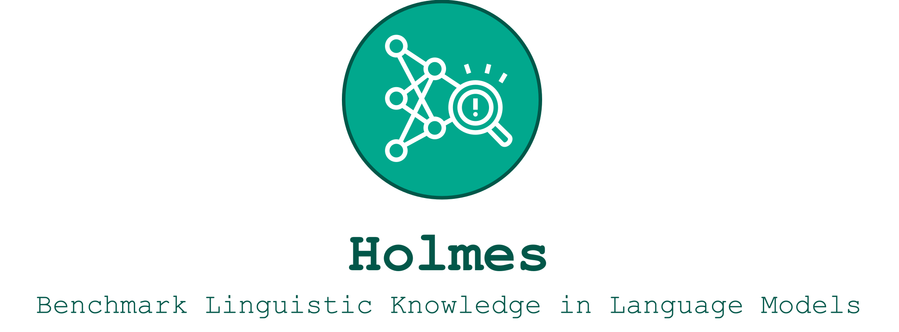

    

        <b><a href="https://holmes-benchmark.github.io/"><b>Project Page</b></a> |</b>
        <b><a href="https://holmes-explorer.streamlit.app/">Explorer 🔎</a> |</b>
        <b><a href="https://holmes-leaderboard.streamlit.app/">Leaderboard 🚀</a></b>
    

[Holmes 🔎](https://holmes-benchmark.github.io) is benchmark dedicated to asses the linguistic competence of language models and features:

* Comprehensive analysis of 66 linguistic phenomena covering _morphology_, _syntax_, _semantics_, _reasoning_, and _discourse_ abilities based on over 200 datasets.
* Benchmark evaluations of 59 language models. Dive into the insights via [Holmes Leaderboard 🚀](https://holmes-leaderboard.streamlit.app/) and [Holmes Explorer 🔎](https://holmes-explorer.streamlit.app/).
* Source code for evaluating new language models using the comprehensive Holmes 🔎 or the streamlined FlashHolmes ⚡.

Missing a specific language model? Either [email us](holmesbenchmark@gmail.com) or evaluate it yourself. 👇

    
    
    
    
    

# 🔎 How does it work?

## 🔎️ Setting up the environment
To evaluate your chosen language model using the Holmes 🔎 or FlashHolmes ⚡ benchmarks, please ensure your setup meets the following requirements:
* Python version 3.10.
* Install all necessary packages using pip install -r requirements.txt`.
* If you want to load language models with `four_bit,` install `bitsandbytes.` If you have trouble installing it, use the version [`0.42.0`](https://github.com/TimDettmers/bitsandbytes/tree/0.42.0) and verify the installation with `python3 -m bitsandbytes`.

## 🔎 Getting the data
Don't worry about parsing linguistic corpora and composing probing datasets: we already did that.
 Find the download instructions for Holmes 🔎 ([here](data/holmes/README.md)) and for FlashHolmes ⚡ ([here](data/flash-holmes/README.md)).

## 🔎 Investigate your language model using one command
For ease of use, you can evaluate a language model with no more than on command like:

The investigation script (`src/investigate.py`) requires the following essential commands:
* `--model_name` is the huggingface tag of the model to investigate, for example [`facebook/bart-base`](https://huggingface.co/facebook/bart-base).
* `--version` is the specific benchmark version on which to evaluate. This corresponds to the [data](data) folder, either ([`holmes`](data/holmes)) for Holmes 🔎 or ([`flash-holmes`](data/flash-holmes)) for FlashHolmes ⚡.
* `--parallel_probing` add this flag parameter if you are in a hurry and want to parallelize stuff.
* `--cuda_visible_devices` specifies the GPU devices to use, for example, with `0,1` the evaluation will us GPU 0 and 1. 

Additional parameters you may need.

* `--dump_folder` (default `./dumps`) is the folder used to save the encoded probing datasets.
* `--force_encoding` add this flag parameter if you want to replace the dumped encodings of the probing dataset. Otherwise, we skip probing datasets when they are already encoded.
* `--model_precision` (default `full`) specifies the precision to use when loading the language model, either `full`, `half`, or `four_bit`. Make sure to install `bitsandbytes` when you want to use `four_bit`.
* `--encoding_batch_size` (default `10`) is the batch size when we encode the probing datasets. Lower this if you encounter out-of-memory errors on the GPU.
* `--in_filter` (default ``) defines a string filter to only consider probing datasets matching this filter. For example, when setting to `rst`, we only consider probing datasets like `rst-edu-depth`.
* `--control_task_types` (default `none`) whether to apply specific control tasks ([Hewitt et al., 2019](https://aclanthology.org/D19-1275/): `none` no control task is applied, `perm` input words will be shuffled randomly, `rand-weights` run the probes with random language model weights, and `randomization` run the probes with randomized labels.
* `--run_probe` (default `True`) run the default linear probe.
* `--run_mdl_probe` (default `False`) run the probe including minimal description length as in [Voita and Titov, 2020](https://aclanthology.org/2020.emnlp-main.14/)
* `--num_hidden_layers` (default `0`) hidden layers to consider within the probe. For example, with `0,1`, we evaluate the probes once with none (linear model) and once with one intermediate layer (MLP).
* `--seeds` (default `0,1,2,3,4`) seeds to consider when probing. With `0,1,2,3,4`, we run every probe five-time using these seeds.
* `--results_folder` (default `./results`) is the folder to save the probing results.
* `--force_probing` add this flag parameter if you want to re-probe and replace already evaluated probing datasets. Otherwise, we skip already probed datasets.
* `--dump_preds` use this flag parameter when you want to dump instance-level predictions for every probe for all probing datasets.

After running all probes an evaluations, you will find the aggregated results in the results folder. Either in `results_holmes.csv` for Holmes 🔎 or `results_flash-holmes.csv` for FlashHolmes ⚡.

# 🔎Disclaimer
We provide datasets in a specific format without endorsing their quality, fairness, or confirming your licensing rights. 
Users must verify their permissions under the dataset's license and properly credit the dataset owner.

If you own a dataset and want to update or remove it from our library, please contact us. 
Additionally, if you wish to include your dataset or model for evaluation, feel free contact as well!
### References

Hewitt, J., & Liang, P. (2019, November). Designing and Interpreting Probes with Control Tasks. In Proceedings of the 2019 Conference on Empirical Methods in Natural Language Processing and the 9th International Joint Conference on Natural Language Processing (EMNLP-IJCNLP) (pp. 2733-2743).

Voita, E., & Titov, I. (2020). Information-theoretic probing with minimum description length. In EMNLP 2020-2020 Conference on Empirical Methods in Natural Language Processing, Proceedings of the Conference (pp. 183-196).